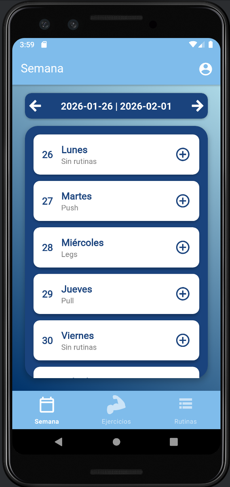
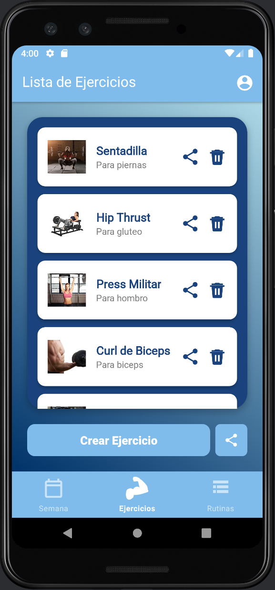
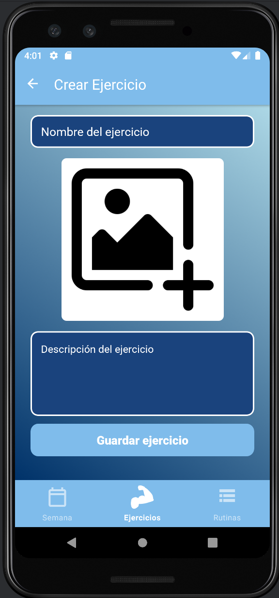
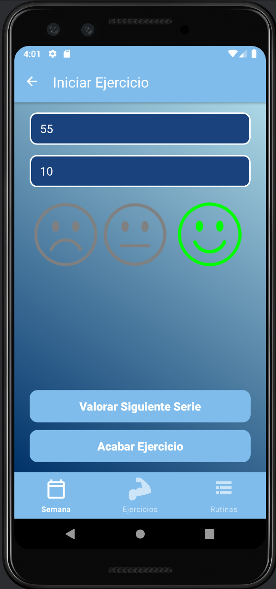

# 🏋️ FitApp | Adaptive Training Ecosystem

**FitApp** is a fully customizable Android application designed to break the rigidity of standard fitness trackers. Unlike apps that force specific workflows, FitApp employs a **User-Centric Design**, allowing athletes to build their own exercise database, design unique routines, and share them via a custom **Code-Sharing Protocol**.

> **⚠️ Academic Project (Software Integration Course)**
> Developed during the 2nd year of Computer Engineering. This project focuses on **Software Architecture**, specifically implementing a decoupled **MVVM pattern** with **Manual Dependency Injection** to ensure scalability.

---

## 📸 Interface & UX Flow

The UI was designed to minimize friction during training sessions while maximizing data capture.

| **Weekly Dashboard** | **Resource Management** |
| :---: | :---: |
|  |  |
| *Personalized agenda view. Users can navigate weeks and manage daily workload.* | *Central repository of exercises. Includes CRUD operations and social sharing features.* |

| **Content Creation** | **Subjective Load (RPE)** |
| :---: | :---: |
|  |  |
| *Atomic customization engine. Users define exercises with custom media and descriptions.* | *Feedback loop implementation. Athletes rate perceived exertion (RPE) using visual cues.* |

---

## 🏗️ Technical Architecture

The codebase follows a strict **Clean Architecture** approach, separating concerns into distinct layers to facilitate testing and maintenance.

### 1. Presentation Layer (MVVM)
* **View (XML & Fragments):** Passive views that only render data and capture user events.
* **ViewModel:** Handles the UI logic and state. It exposes data streams to the View using **LiveData**, ensuring the UI is always reactive to data changes without tight coupling.

### 2. Domain & Data Layer
* **Repository Pattern:** Acts as a single source of truth. It abstracts the data origin (whether it comes from local cache or the cloud), providing a clean API to the ViewModels.
* **Manual Dependency Injection:** Instead of relying on "magic" frameworks like Hilt at this stage, dependencies are injected manually. This ensures a deep understanding of the **Inversion of Control (IoC)** principle and object lifecycles.
* **Firebase Integration:** Used for cloud persistence, allowing real-time synchronization of user profiles and shared routines.

### 3. Feature-First Development
The development followed a rigorous **UseCase-driven approach**. We adhered to the **Open/Closed Principle** (SOLID), ensuring that new features (like a new sharing method) could be added as new modules without modifying the existing, tested core logic.

---

## 🚀 Key Features

### 🔄 The "Deep Share" Protocol
One of the most complex engineering challenges was the sharing system.
* **Problem:** How to share complex object graphs (Routines containing multiple Exercises) between users without a backend API server.
* **Solution:** Implemented a **Serialization Engine** that converts local entities into unique alphanumerical codes. When a user inputs a friend's code, the app parses the remote object and clones the structure into their local database.

### 🧠 Subjective Load Monitoring
Beyond just tracking weights (kg) and reps, the app implements a **Qualitative Feedback System**.
* Users rate their **RPE (Rate of Perceived Exertion)** using a visual traffic-light interface (Green/Yellow/Red).
* This data is stored to help users analyze fatigue trends over time, a feature typically reserved for professional coaching apps.

### 🛠️ Total Customization
* **Dynamic Entity Creation:** Users are not limited to a pre-defined list. They can instantiate new `Exercise` objects with custom metadata.
* **Onboarding Strategy:** The app includes a "Seed Strategy" that pre-populates the database with essential movements for first-time users, avoiding the "Empty State" problem.

---

## 💻 How to Run

1.  Clone the repository.
2.  Open the project in **Android Studio** (Chipmunk or newer recommended).
3.  Sync Gradle files.
4.  Create a Firebase project and add your own `google-services.json` to the `/app` folder (required for authentication).
5.  Run on an Emulator or Physical Device.
